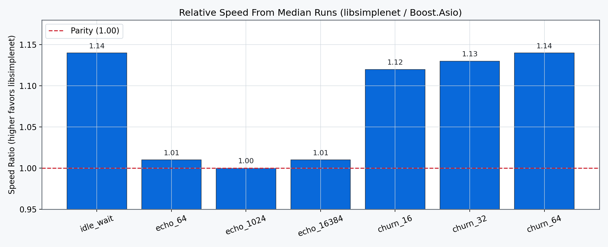
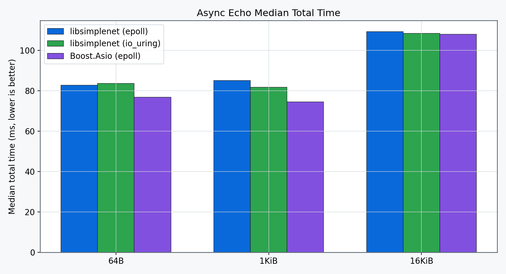
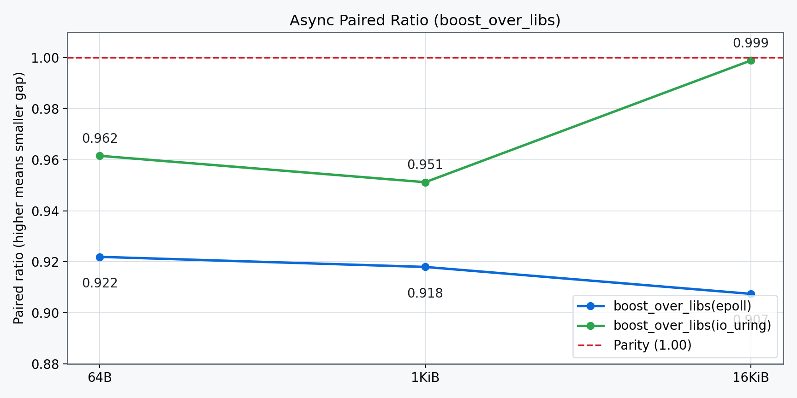

# libsimplenet

A production-oriented C++23 Linux networking library with async runtime support over both `epoll` and `io_uring`.

## Key Properties

- C++23 coroutine-based async runtime.
- Linux backend support:
  - `epoll`
  - `io_uring`
- Foundation networking APIs for blocking and nonblocking TCP/UDP.
- Backend-agnostic async operations (`accept`, `connect`, `read`, `write`, timers, cancellation).
- Backpressure helper queue for throughput-safe writes.
- Owning enqueue path for write queue (`std::vector<std::byte>&&`) to avoid
  extra user-buffer copies.

## Build

Prerequisites (host build):

- CMake 3.24+
- Ninja (or another CMake generator)
- C++23 compiler (GCC 14+/Clang 17+ recommended)
- `liburing` development package
- network access for fetching GoogleTest during test configuration

```bash
cmake -S . -B build -G Ninja -DCMAKE_BUILD_TYPE=Debug
cmake --build build -j
```

## Install

```bash
cmake -S . -B build-release -G Ninja -DCMAKE_BUILD_TYPE=Release
cmake --build build-release -j
cmake --install build-release --prefix /usr/local
```

Consumer usage:

```cmake
find_package(libsimplenet CONFIG REQUIRED)
target_link_libraries(your_app PRIVATE simplenet::simplenet)
```

## Test

```bash
ctest --test-dir build --output-on-failure
```

## Coverage

Additional prerequisite:

- `gcovr` on `PATH`

```bash
cmake -S . -B build-coverage -G Ninja -DCMAKE_BUILD_TYPE=Debug -DSIMPLENET_ENABLE_COVERAGE=ON
cmake --build build-coverage -j
cmake --build build-coverage --target coverage
```

Coverage artifacts are generated in `build-coverage/coverage/`.

## Documentation

- Development internals: `docs/development/`
- API/user guides: `docs/usage/`
- Planning artifacts and roadmap: `planning/`

Generate API docs (Doxygen):

```bash
cmake --build build --target doc
```

Output path:

- `build/docs/doxygen/html/index.html`

## License

MIT (`LICENSE`).

## Comparison Snapshot (vs Boost.Asio)

| Capability | Boost.Asio | libsimplenet | Status |
| --- | --- | --- | --- |
| Backend abstraction (`epoll`/`io_uring` equivalent runtime integration) | Yes | Yes | Parity |
| Coroutine-friendly async TCP ops | Yes | Yes | Parity |
| Async DNS resolver | Yes | Yes (`runtime::async_resolve`) | Parity |
| Buffer ownership for queued async writes | Yes (buffer sequences / ownership patterns) | Yes (`queued_writer::enqueue(std::vector<std::byte>&&)`) | Mitigated gap |
| TLS stream abstraction | Yes | Not yet | Open gap |
| Async UDP runtime APIs | Yes | Not yet | Open gap |
| Strand/executor orchestration model | Yes | Not yet | Open gap |

Mitigation implemented in this pass:
- Added owning enqueue API for `queued_writer` so callers can move already-built
  buffers into the queue without another copy.
- Removed nested coroutine/task churn in `runtime::async_read_exact` and
  `runtime::async_write_all` by inlining nonblocking read/write retry loops.

## Performance Comparison vs Boost.Asio

Comparison is now multi-scenario and fairness-controlled, not a single
microbenchmark.

Fairness controls:
- Same machine/container and kernel path.
- Same Release optimization tier (`-O3` / `CMAKE_BUILD_TYPE=Release`).
- Same scenario parameters (iterations, payload size, connection levels).
- Same synchronous TCP model for echo/churn comparisons.
- Same neutral blocking client driver for async echo comparisons (raw POSIX sockets).
- Alternating implementation run order for each repeat.
- Async comparisons use pairwise alternating order for each pair:
  - `libsimplenet(epoll)` vs `boost_asio(epoll)`
  - `libsimplenet(io_uring)` vs `boost_asio(epoll)` when `io_uring` is available
- Enforced even repeat count for order balance (default `PERF_REPEATS=6`).
- `PERF_PAIRED_MEDIAN` aggregation from paired per-repeat ratios.

Suite command:

```bash
bash ./scripts/run_perf_suite.sh
```

Latest persisted output:
- Benchmark artifacts and history: `docs/development/perf-data/`
- Methodology and iteration logs: `docs/development/performance-lab-log.md`

### Core Scenario Matrix (Baseline 2026-02-20, Median of 6 Alternating Runs)

| Scenario | libsimplenet | Boost.Asio | Relative (Paired Median Ratio) |
| --- | ---: | ---: | ---: |
| `idle_wait` (`avg_ns_per_wait`) | `113.398` | `128.721` | libsimplenet `~1.14x` faster |
| `tcp_echo` payload `64` (`total_ms`) | `133.303` | `134.634` | libsimplenet `~1.01x` faster |
| `tcp_echo` payload `1024` (`total_ms`) | `135.684` | `135.590` | libsimplenet `~1.00x` faster |
| `tcp_echo` payload `16384` (`total_ms`) | `147.782` | `149.056` | libsimplenet `~1.01x` faster |
| `connection_churn` `16` (`total_ms`) | `311.935` | `352.247` | libsimplenet `~1.12x` faster |
| `connection_churn` `32` (`total_ms`) | `569.255` | `638.269` | libsimplenet `~1.13x` faster |
| `connection_churn` `64` (`total_ms`) | `1069.240` | `1211.886` | libsimplenet `~1.14x` faster |

### Async I/O Matrix (Three Targets)

All rows below are from `scenario=async_tcp_echo` with identical
`iterations=2000`, `connections=8`, and `PERF_REPEATS=6`.

| Payload | libsimplenet `epoll` (`ms`) | libsimplenet `io_uring` (`ms`) | Boost.Asio `epoll` (`ms`) | Paired `boost/libs(epoll)` | Paired `boost/libs(io_uring)` | `epoll/io_uring` (`libs`) |
| --- | ---: | ---: | ---: | ---: | ---: | ---: |
| `64` | `82.739` | `83.655` | `76.742` | `0.897905` | `0.935181` | `0.989` |
| `1024` | `85.042` | `81.731` | `74.517` | `0.884594` | `0.925209` | `1.040` |
| `16384` | `109.326` | `108.340` | `107.950` | `0.969676` | `1.002933` | `1.009` |

Interpretation:
- `boost/libs(...)` is based on paired medians for `total_ms`; values closer to
  `1.0` mean smaller gap.
- `epoll/io_uring` compares libsimplenet backends directly; values above `1.0`
  mean `io_uring` is faster than libsimplenet `epoll`.

Repeated-run (`hyperfine`) checks for noisy scenarios are also persisted in:
- `docs/development/perf-data/2026-02-19-hyperfine-idle.txt`
- `docs/development/perf-data/2026-02-19-hyperfine-echo-16k.txt`
- `docs/development/perf-data/2026-02-19-hyperfine-churn-64.txt`

Notes:
- `PERF_RUN` lines contain each individual run.
- `PERF_MEDIAN` lines are the reported headline numbers.
- `PERF_PAIRED_MEDIAN` lines provide the fairness-preferred ratio signal.
- `PERF_META_ASYNC` captures async suite parameters and `io_uring` availability.
- `PERF_SKIP` is emitted when async `io_uring` is unavailable on the host.
- Table `Relative` values come from `PERF_PAIRED_MEDIAN`, while the middle
  columns show per-implementation medians.







Regenerate these figures with:

```bash
python3 scripts/generate_perf_figures.py
```
